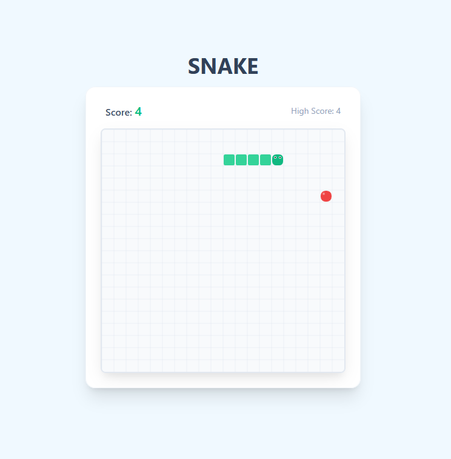

# 🐍 Snake Game – Modern Web Version

Un **gioco Snake moderno**, elegante e responsive, realizzato in **HTML, CSS (Tailwind)** e **JavaScript**.
Interfaccia pulita, animazioni fluide e salvataggio automatico dell’high score tramite `localStorage`.



---

## 🚀 Caratteristiche principali

* 🎨 **UI moderna** con Tailwind CSS
* 🐍 **Movimento fluido** con collisioni precise
* 🍎 **Cibo generato casualmente** sempre fuori dal corpo del serpente
* ⚡ **Velocità progressiva** ad ogni punto
* 💾 **High Score salvato** localmente
* 📱 **Controlli touch** per smartphone
* 🖥️ **Canvas 400×400** con griglia elegante
* 🔄 **Restart immediato** usando le frecce direzionali
* 📝 **Documentazione con JSDoc** per la logica di gioco
* ✅ **Unit test** con Jest per le funzioni principali

---

## 📦 Tecnologie utilizzate

* **HTML5 Canvas**
* **JavaScript (ES6 Modules)**
* **Tailwind CSS**
* **LocalStorage API**
* **Jest** per unit test
* **JSDoc** per documentazione

---

## ▶️ Come giocare

### Desktop

* Usa le **frecce direzionali** o `W/A/S/D` per muovere il serpente.
* Evita bordi e collisioni con il corpo.

### Obiettivo

* Mangia le mele rosse (🍎) per far crescere il serpente e aumentare il punteggio.
* Evita collisioni e bordi per non perdere la partita.

---

## 🛠️ Installazione & Avvio

Clona il repository:

```bash
git clone https://github.com/MagicMBK/Progetto_Decano-Bolis.git
```

Entra nella cartella del progetto:

```bash
cd Progetto_Decano-Bolis/progetto
```

Apri `index.html` in un browser moderno.
*(Consigliato usare Live Server per sviluppo attivo.)*

---

## 📁 Struttura del progetto

```
/
├── .gitignore
├── jsdoc.json                    # Configurazione JSDoc
├── package-lock.json
├── package.json
├── README.md                     # Questo file
├── assets
│   └── preview.png               # Anteprima del gioco
├── docs                          # Documentazione generata con JSDoc
└── progetto
    ├── index.html                # Pagina principale
    ├── js
    │   ├── game.js               # Logica del gioco (classe SnakeGame)
    │   └── main.js               # Rendering, input, loop
    └── test
        └── game.test.js          # Unit test base
```

---

## 🧩 Personalizzazione

Puoi modificare facilmente:

* 🎨 **Colori del serpente** → nella funzione `disegnaCella` di `main.js`
* 📏 **Dimensione griglia** → `dimensioneGriglia` in `SnakeGame`
* 🏁 **Velocità iniziale** → `velocitaIniziale` in `SnakeGame`
* 🔊 **Suoni** → aggiungendo audio al gameplay
* 🟦 **Dimensioni canvas** → attributi `width` e `height` in `index.html`

---

## 📜 Licenza

Rilasciato sotto **MIT License** – libero per usi personali e commerciali.

---

## ⭐ Supporta il progetto

Se ti piace, lascia una **star ⭐** sul repository!
